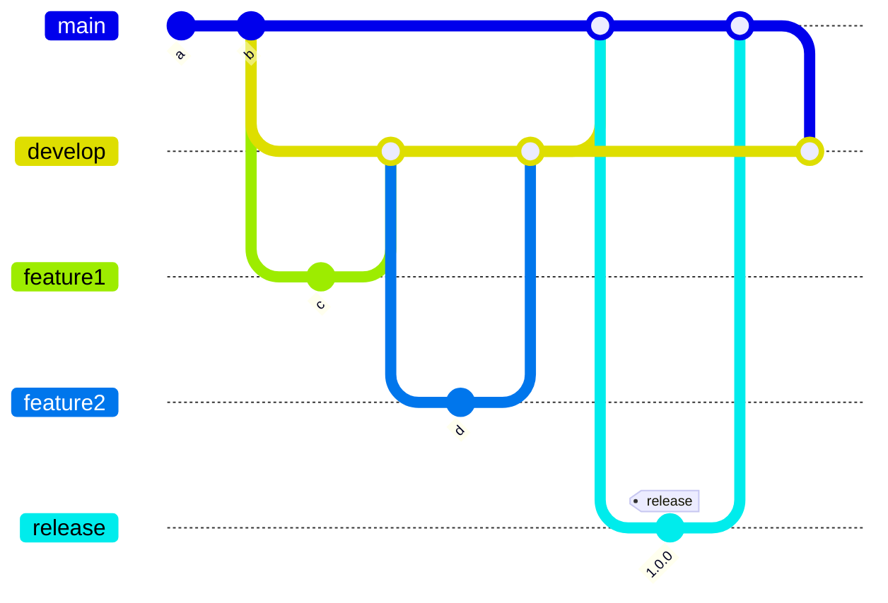

# Welcome to our docs contributing guide

Thank you for investing your time in contributing to our project! We sincerely appreciate it. :sparkles:.
Please, read our [Code of Conduct](./CODE_OF_CONDUCT.md) to keep our community approachable and respectable.

## Content <!-- omit in toc -->

- [Welcome to our docs contributing guide](#welcome-to-our-docs-contributing-guide)
  - [New contributor guide](#new-contributor-guide)
  - [Getting started](#getting-started)
    - [:file\_folder: File Structure](#file_folder-file-structure)
  - [Issues](#issues)
      - [Create a new issue](#create-a-new-issue)
    - [Solve an issue](#solve-an-issue)
      - [Prerequisites](#prerequisites)
      - [Commits](#commits)
      - [Branch](#branch)

## New contributor guide

To get an overview of the project, read the [README](../README.md). Here are some resources to help you get started with open source contributions:

- [How to install git](https://git-scm.com/book/en/v2/Getting-Started-Installing-Git)
- [How to handle repositories](https://docs.gitlab.com/ee/user/project/repository/)
- [Creating an issue](https://docs.github.com/en/issues/tracking-your-work-with-issues/creating-an-issue)
- [Creating merge requests](https://docs.gitlab.com/ee/user/project/merge_requests/creating_merge_requests.html)

## Getting started

### :file_folder: File Structure

    .
    └── .husky            // contains git hooks
    └── .github           // GitHub workflows
    └── assets            // files like images for the documentation
    └── docs              // documentation of the project
    └── src
        └── __tests__     // Unit test (*.spec.ts)
        └── commands      // CLI's commands classes
        └── shared        // Global configuration and log messages
        └── docs          // the documentation skeleton
        └── root          // the configuration file blueprint
    └── coverage          // jest coverage report
    └── dist              // build output
    └── bin               // cli entrypoint
    └── CHANGELOG.md      // This file is automatically created by the release stage of the main pipeline. Please don't touch it.

## Issues

#### Create a new issue

If you spot a problem with the tool or the documentation, please [search if an issue already exists](https://git.sinnerschrader.com/deven/documentation-skeleton/-/issues/). If a related issue doesn't exist, you can open a new issue using the same page.

<details>
<summary>How to write a useful issue?</summary>
<br />

- It should be _reproducible_. It should contain all the instructions needed to reproduce the same outcome.

- It should be _specific_. It's important that it addresses one specific problem.

</details>

### Solve an issue

Scan through our [existing issues](https://git.sinnerschrader.com/deven/documentation-skeleton/-/issues/) to find one that interests you.
If you find an issue to work on, you are welcome to open a merge request with a fix.

#### Prerequisites

Please, before submitting any merge request, be sure that your branch is passing all requirements.

1. Check that all tests are working:

```bash
npm run test
```

2. Check that there are no linting issues:

```bash
npm run lint
```
(the command will also try to fix found issues)

3. Check that the files are formatted:

```bash
npm run prettier
```
(the command will also try to fix found issues)
#### Commits

The commits must be compliant with the [Conventional Commits specification](https://www.conventionalcommits.org/en/v1.0.0/).

#### Branch

We use the [Git-Flow](https://www.atlassian.com/git/tutorials/comparing-workflows/gitflow-workflow) branching model:


