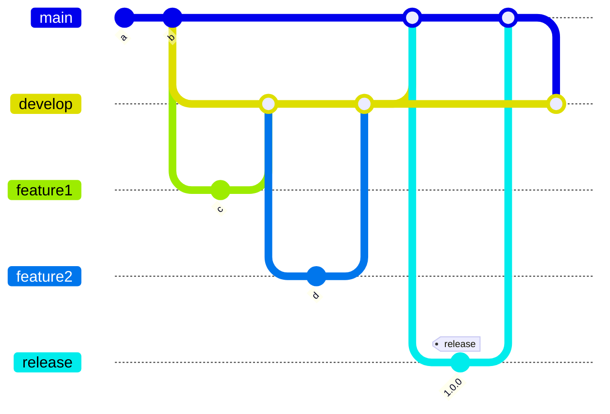

# Deployment

The documentation skeleton project will be deployed on every update of the main branch.

## Content <!-- omit in toc -->

- [Deployment](#deployment)
  - [Tooling](#tooling)
    - [Release Please](#release-please)
    - [Conventional Commit Messages](#conventional-commit-messages)
  - [How to deploy](#how-to-deploy)
  - [Versioning](#versioning)
  - [Deployment Schedule](#deployment-schedule)
  - [Support](#support)

## Tooling

This project uses release-please and conventional commit messages for automated release creation and deploys the package to the npm registry.

We use the [Git-Flow](https://www.atlassian.com/git/tutorials/comparing-workflows/gitflow-workflow) branching model:

### Release Please

Release Please automates CHANGELOG generation, the creation of GitHub releases, and version bumps for your projects. Release Please does so by parsing the git history, looking for Conventional Commit messages, and creating release PRs.

The tool runs on every update on the `main` branch and creates a release PR which needs to be manually be merged to create the release.

The updated `main` branch then needs to be merged back, please use rebase, into the `develop` branch.

Due to the open source nature of this project it was decided it is best to have a `develop` branch to test all new features together before an official release is created.

### Conventional Commit Messages

We use [Conventional Commit messages](https://www.conventionalcommits.org/en/v1.0.0/) to be able to create changelog and version bumps automatically.

We have a pre-push hook installed that uses [commit lint](https://github.com/conventional-changelog/commitlint) to verify the commits messages are following the conventional commit message standard.

## How to deploy

One needs to create a new PR from `develop` to `main`. Once the PR is approved and merged the GitHub workflow `release` will be started.

The `release` workflow will first run the tests and after they were successful a new release branch is created together with a PR from the release branch into `main`.

Lastly a notification for the internal slack channel is created.

The newly created release PR needs to be manually merged into main to finish the package creation and release publishing.

After the release PR is merged the `develop` branch also needs to be updated by rebasing it onto the `main` branch.

## Versioning

Please see [conventional commit messages](#conventional-commit-messages)

## Deployment Schedule

There is no deployment schedule. A new release is created whenever we have multiple new small features or a new big feature that we want to release.

## Support

If you need support with the release process please [create an issue](https://github.com/deven-org/hamster/issues) or get in touch with [Jumace](https://github.com/Jumace).
